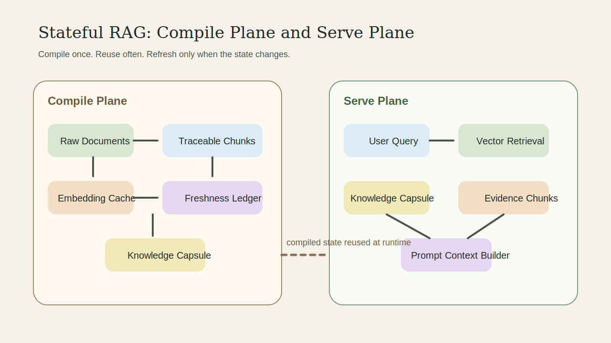
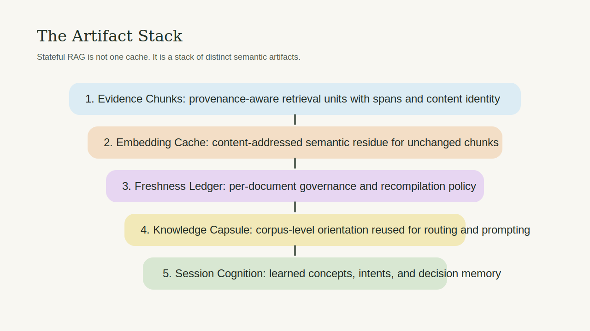
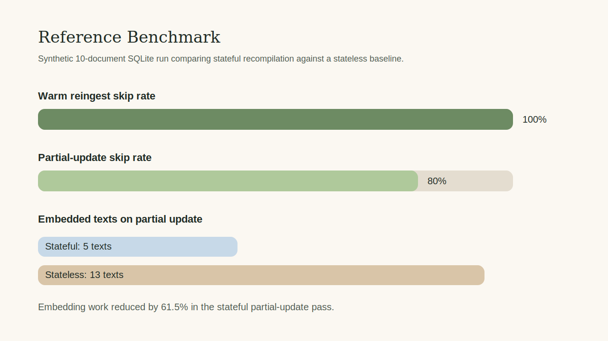

# ragmake

[](https://github.com/fatjons/ragmake/actions/workflows/ci.yml)
[](LICENSE)
[](https://www.python.org/)

**RAG without corpus memory is blind guessing.**

Standard retrieval pipelines give an agent whatever chunks scored highest for a
query. The agent has no idea what the corpus actually contains — it reasons from
fragments and hopes the retriever surfaced the right ones. Every run starts from
zero, re-embedding everything, recomputing everything, knowing nothing.

ragmake changes the equation.

It compiles your documents into persistent state and distills a **nectar** — a
corpus-level synthesis that tells the agent what the corpus _is_, not just what
a query happened to surface. Nectar is compiled once and refreshed only when
content changes. The agent walks into every conversation already knowing the
terrain.



---

## The core idea: nectar

In a standard RAG pipeline the agent is reactive. It sees retrieved chunks and
has to infer the shape of the corpus from those fragments alone. If retrieval
misses something relevant, the agent never knew it existed.

ragmake adds a proactive layer. Before any query runs, the compiler reads the
entire corpus and distills it into nectar: the scope, dominant concepts, recurring
terminology, and document set — all in one compact, pre-built summary. Nectar is
not a retrieval result. It exists independently of any query and persists across
runs.

At query time ragmake assembles two things for the agent:

| Layer        | What it is                                                | When it's built                                      |
| ------------ | --------------------------------------------------------- | ---------------------------------------------------- |
| **Nectar**   | What the corpus contains — its scope, concepts, and shape | Compile time. Cached. Rebuilt only on corpus change. |
| **Evidence** | What's specifically relevant to this query                | Query time. Retrieved from the vector store.         |

Together they give the agent both the map and the territory. The agent doesn't
have to guess what the knowledge base covers — it already knows.

---

## What "stateful" means

ragmake builds persistent state from your documents and reuses it. Nothing is
recomputed unless content has actually changed:

- **Document hash check** — unchanged documents are skipped entirely
- **Chunk embedding cache** — unchanged chunks within a changed document reuse cached vectors
- **Corpus signature** — nectar is rebuilt only when the set of document hashes changes

Only changed content costs anything. Everything else is free on re-ingest.



This is the "make" in ragmake. Like a build system, it tracks what changed and
only rebuilds those targets. The rest of the state is reused as-is.

---

## Install

Python 3.11+ required.

```bash
pip install ragmake
```

Optional extras:

```bash
pip install 'ragmake[openai]'    # OpenAI-compatible embeddings and synopsis
pip install 'ragmake[azure]'     # Azure Blob + Azure AI Search
pip install 'ragmake[postgres]'  # Postgres + pgvector
```

Or from source:

```bash
pip install -e .
```

---

## Quick start

```python
from pathlib import Path

from stateful_rag import (
    FileArtifactStore,
    HashingEmbedder,
    HeuristicSynopsisCompiler,
    InMemoryVectorStore,
    SourceDocument,
    StatefulRAGCompiler,
    StatefulRAGRuntime,
    WordChunker,
)

# Build the compiler — this is what creates and maintains corpus state
compiler = StatefulRAGCompiler(
    artifact_store=FileArtifactStore(Path(".ragmake_state")),
    vector_store=InMemoryVectorStore(),
    embedder=HashingEmbedder(),
    synopsis_compiler=HeuristicSynopsisCompiler(),
    chunker=WordChunker(max_words=120, overlap_words=20),
)

# Ingest documents — nectar is compiled after this
compiler.ingest_documents([
    SourceDocument(
        corpus_id="support-kb",
        document_id="refund-policy.txt",
        text="Enterprise refunds are allowed within 30 days when the onboarding pack is unused.",
    ),
    SourceDocument(
        corpus_id="support-kb",
        document_id="api-access.txt",
        text="Workspace admins can rotate API keys from the admin console.",
    ),
])

# Build the runtime — this is what the agent uses at query time
runtime = StatefulRAGRuntime(
    compiler=compiler,
    vector_store=compiler.vector_store,
    embedder=compiler.embedder,
)

# The agent receives nectar (what the corpus is) + evidence (what's relevant)
context = runtime.build_context(
    "What do I need for an enterprise refund?",
    corpus_id="support-kb",
)
payload = runtime.render_prompt_payload(context)

# payload["synopsis"] — the nectar: corpus-level memory, query-independent
# payload["sources"]  — the evidence: top matching chunks for this query
```

Reingest the same documents unchanged — zero embedder calls, nectar unchanged,
state fully reused.

---

## With a real embedder (OpenAI)

```python
from openai import OpenAI
from stateful_rag.adapters import OpenAICompatibleEmbedder, OpenAISynopsisCompiler, SQLiteArtifactStore, SQLiteVectorStore

client = OpenAI(api_key="...")

compiler = StatefulRAGCompiler(
    artifact_store=SQLiteArtifactStore(".ragmake/state.db"),
    vector_store=SQLiteVectorStore(".ragmake/state.db"),
    embedder=OpenAICompatibleEmbedder(client, model="text-embedding-3-large"),
    synopsis_compiler=OpenAISynopsisCompiler(client, model="gpt-4o-mini"),
)
```

The `OpenAISynopsisCompiler` uses a chat completion to write the nectar from
representative corpus chunks. The result is stored and reused until the corpus
changes.

---

## What the agent prompt payload looks like

```json
{
  "query": "What do I need for an enterprise refund?",
  "corpus_id": "support-kb",
  "content_signature": "a3f9...",
  "synopsis": "Corpus covers enterprise billing, refund eligibility, and API key management...",
  "sources": [
    {
      "document_id": "refund-policy.txt",
      "chunk_id": 0,
      "score": 0.91,
      "text": "Enterprise refunds are allowed within 30 days..."
    }
  ]
}
```

`synopsis` is the nectar. It is always present, always current, always
independent of the query. The agent can orient itself before reading a single
chunk.

---

## CLI

The demo entry point ingests plain UTF-8 text files into a persistent SQLite
state directory and renders a prompt payload for a query:

```bash
ragmake-demo --query "What changed in the refund policy?" docs/refund.txt docs/api.txt
```

Options:

- `--corpus` — corpus id (default: `demo`)
- `--state-dir` — where the SQLite file lives

The benchmark compares stateful ingest against a stateless rebuild across cold,
warm, and changed-document phases:

```bash
ragmake-benchmark --documents 200 --change-fraction 0.1
ragmake-benchmark --documents 200 --change-fraction 0.1 --backend sqlite --format json
```



---

## Included implementations

**Core interfaces** — implement any of these to swap a backend:

- `ArtifactStore` — read/write/iterate JSON artifacts
- `Embedder` — embed a batch of texts
- `VectorStore` — upsert, delete, list, search chunks
- `SynopsisCompiler` — compile nectar from corpus chunks

**Local defaults** (zero extra dependencies):

- `FileArtifactStore` — JSON files on disk, easy to inspect
- `InMemoryArtifactStore` — tests and ephemeral runs
- `InMemoryVectorStore` — tests and ephemeral runs
- `HashingEmbedder` — deterministic fallback for local demos and tests
- `HeuristicSynopsisCompiler` — LLM-free nectar for local demos and tests
- `SessionStateManager` — per-session learned concepts, entities, and intents

**Optional adapters:**

- `OpenAICompatibleEmbedder` — OpenAI or Azure OpenAI embeddings
- `OpenAISynopsisCompiler` — LLM-backed nectar via chat completions
- `SQLiteArtifactStore` / `SQLiteVectorStore` — durable local backend, one file
- `AzureBlobArtifactStore` / `AzureAISearchVectorStore` — Azure cloud backend
- `PostgresArtifactStore` / `PgVectorStore` — Postgres + pgvector backend

---

## Session memory

ragmake can optionally carry per-session state into the prompt payload — learned
concepts, discussed entities, recent intents, and recent decisions. This lets
the agent layer short-term conversational memory on top of the long-term corpus
memory (nectar).

```python
from stateful_rag import SessionStateManager

session_manager = SessionStateManager(artifact_store)
runtime = StatefulRAGRuntime(..., session_manager=session_manager)

session_manager.record_learning(
    "customer-42",
    summary="User is handling enterprise billing questions.",
    concepts=["enterprise refunds", "invoice workflow"],
    entities=["Acme Corp"],
)

context = runtime.build_context(
    "What do I need for an enterprise refund?",
    corpus_id="support-kb",
    session_id="customer-42",
)
# payload["session"] now carries learned_concepts, discussed_entities,
# recent_intents, recent_decisions
```

---

## Current limits

- `WordChunker` is word-based, not tokenizer-aware.
- `HashingEmbedder` and `HeuristicSynopsisCompiler` are for tests and local demos, not production.
- Omitting a document from a later ingest does not delete it; the compiler only updates documents you pass in.
- `SQLiteVectorStore` uses Python-side cosine search — suitable for local and moderate corpus sizes.

---

## Reference

Full architecture, artifact model, adapter notes, persistent local walkthrough,
and benchmark behavior:

- [docs/reference.md](docs/reference.md)

---

## License

MIT — see [LICENSE](LICENSE).
